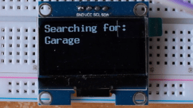

<!DOCTYPE html>
<html>
  <head>

  <body>
    <h1>ESP8266 Stock/Crypto OLED</h1>
    </img>
    <h3><u>Summary</u></h3>
    
ESP8266 based stock price display (not really a ticker because it doesn't move) that uses an OLED (SH1106), that receives the ticker symbol from
      self served webpage.

    
I am currently using Yahoo Finance for price info every 5 seconds but you
      can change that to the API of your choice along with the update frequency.

  
The ESP8266 needs the RSA fingerprint method, and it get updated randomly. You can get the fingerprint <a href="https://www.grc.com/fingerprints.htm">here</a>.

    
I am not a developer or programmer, so my code is not pretty, but I'm working on it.

    
This code is compatible with Arduino.

    <h3><u>Libraries Used:</u></h3>
    
<a href="https://github.com/olikraus/u8g2" target="_blank">U8x8 (it's part of U8G2)</a>
      by <a href="https://github.com/olikraus" target="_blank">Olikraus</a> 
      <a href="https://github.com/me-no-dev/ESPAsyncWebServer" target="_blank">ESPAsyncWebServer</a>
      by <a href="https://github.com/me-no-dev" target="_blank">Me No Dev</a> 
  <a href="https://github.com/bblanchon/ArduinoJson">ArduinoJson</a>

    <h3><u>Setup</u></h3>
    
Connect your ESP8266 to your i2c OLED. I use the standard D1(SCL) and D2 (SDA).

    
You must insert your own SSID and password for your Wifi, so it can
      connect. 

    
Upon getting an IP address it will display it continually on the OLED until it receives its first ticker symbol.

    
From any browser input the IP address where you will be presented with a
      ticker input. 

    
The program will automatically check for a new price every 5 seconds.

    
It also supports crypto, but you must use the Yahoo Finance format, for
      example BTC-USD for Bitcoin or DOGE-USD for Doge. Other currencies are supported.

    
Any symbol that works on Yahoo Finance should technically work.

    
It also calculates the percentage gain or loss from the previous close.

     
  <h3><u>FAQ</u></h3>
  
<b>What happens when I put a bad ticker? Like "None"?</b> 
  An error will display on the OLED.

  <h3><u>TODO</u></h3>
  1) Multiple ticker support
 
  </body>
</html>
